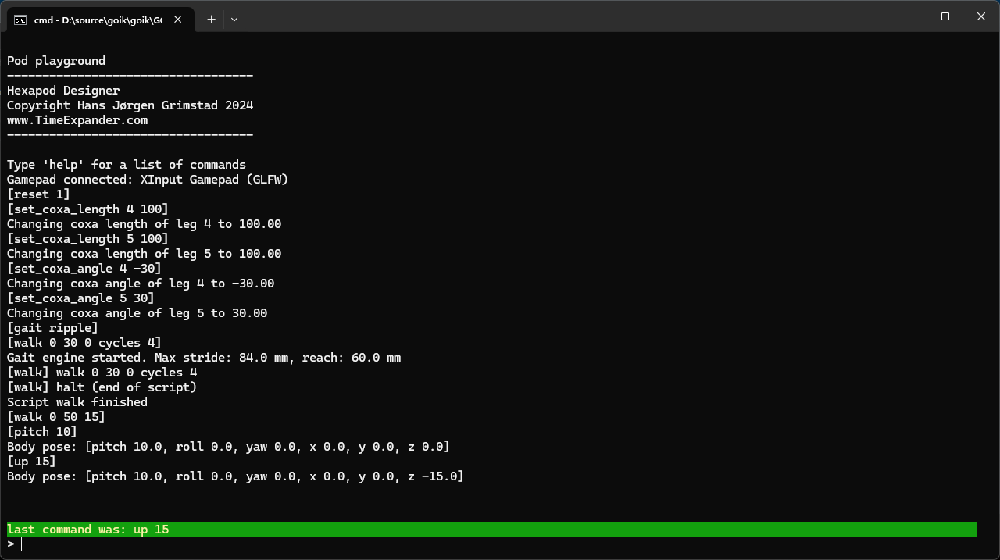
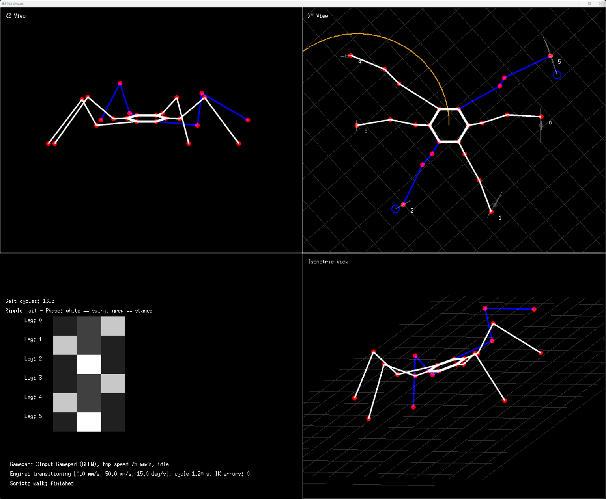
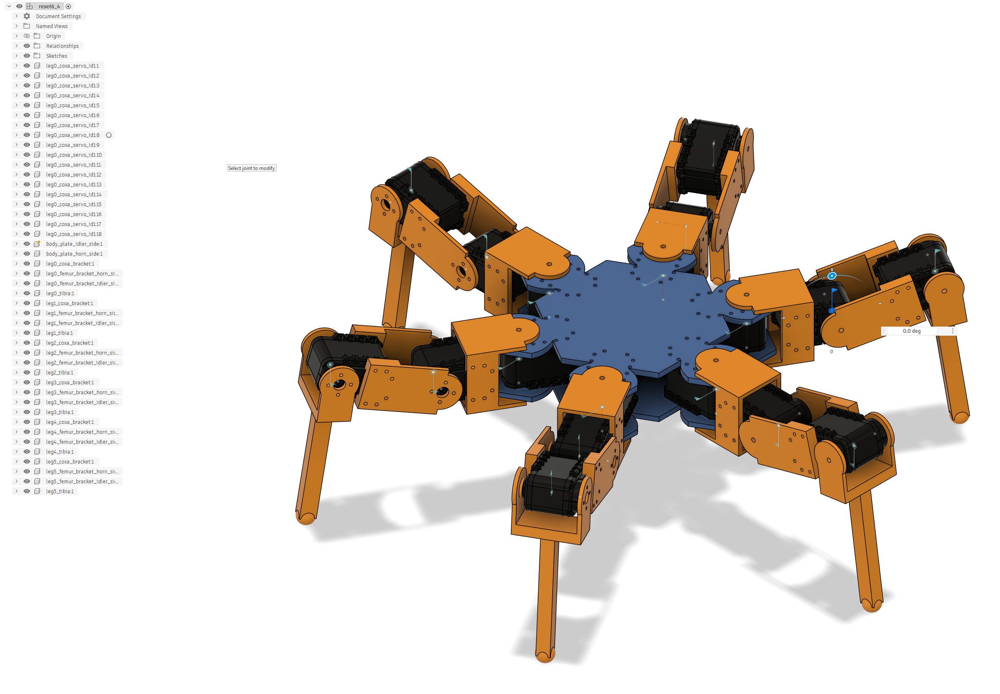

# GOIK hexapod designer

This is a tool for simulating and designing hexapods, octopods, or any pod you can imagine (as long as it is using limbs with three degrees of freedom and the inverse kinematics equations have a solution)

Any leg orientations is ok, any number of legs is ok, any combination of coxa, femur and tibia lenghts is ok. You can even mix and match with different style legs and leg anchor points and orientations on the same pod, since the kinematics equations are generic.

Hexapods can use tripod, ripple and wave gait. Pods with a different number of limbs are so far limited to wave gait. Gait transitions are smooth, and happen mid-stride while the pod walks.

I decided to make this tool to be able to iterate faster when designing my own hexapods.

> No promises though. There will be [bugs](https://github.com/hansj66/goik/issues).

It has so far been tested on Mac and Windows

## Documentation

| Document | About |
|---|---|
| [Using the simulator](./goik/docs/simulator.md) | The views, the example pods and all shell commands |
| [Designing a pod](./goik/docs/designing-a-pod.md) | Body, legs, segment lengths, joint angles and stance, with examples |
| [Pod designer](./goik/docs/pod-designer.md) | Plan for the interactive pod designer |
| [The gait engine](./goik/docs/gait-engine.md) | How walking, gait transitions and the body pose work |
| [Motion scripts](./goik/docs/scripts.md) | Chaining walks, turns, gait changes and poses in a script |
| [Servos](./goik/docs/servos.md) | Servo mapping, servo models and Dynamixel hardware |
| [CAD export](./goik/docs/cad-export.md) | Exporting a pod as a STEP assembly with printable brackets |
| [Joints in Fusion 360](./goik/docs/fusion-joints.md) | Moving the joints of an export in Fusion 360 |
| [Servo models](./goik/docs/servo-models.md) | Servo geometry and vendor models for the CAD export |
| [Kinematics](./goik/docs/kinematics.md) | Forward and inverse kinematics, and gait patterns |
| [Design notes](./goik/docs/design-notes.md) | Motion chaining and the Overlord robot controller (plans) |

The code is servo agnostic: servo ids, orientation and range are defined in the servo mapping. The target robot
controller is the Raspberry Pi CM5 based [Overlord](https://github.com/hansj66/overlord) board. What's next is in the
[roadmap](./goik/ROADMAP.md), known bugs in [BUGS.md](./goik/BUGS.md).

## Building the simulator

The simulator is written in Go. If you don't have Go installed on your machine, you can download it from [here](https://go.dev/).
Some platforms need extra packages for [Ebitengine](https://ebitengine.org/en/documents/install.html), the 2D engine used for the views.

Navigate to the goik/goik folder and type:

```sh
>go build
```

This will create an executable called "GOIK.exe" on Windows or "GOIK" on Mac and Linux. Run it from the goik/goik
folder, since it looks for `scripts`, `pods` and `cad` relative to the current folder.

### Make targets

The goik/goik folder has a Makefile with shortcuts. Make is optional: every target is a single command that can also be
typed directly.

| Target | Command | Does |
|---|---|---|
| `make build` | `go build` | Build the simulator |
| `make test` | `go test ./...` | Run the tests |
| `make run` | `go run .` | Build and start the simulator |
| `make cad-setup` | `python cad/tools.py setup` | Install CadQuery in `cad/.venv`, needed for the CAD export (Python 3.9 - 3.12) |
| `make cad-vendor` | `python cad/tools.py vendor` | Download the vendor servo models that can be downloaded, and explain the others |
| `make cad-check` | `python cad/tools.py check` | Show what is installed, downloaded and measured for the CAD export |

Use another Python for the CAD targets with `make cad-setup PYTHON=python3`. See the
[CAD export](./goik/docs/cad-export.md) documentation.

Installing make:

* Windows: `winget install ezwinports.make` (open a new terminal afterwards, so the updated PATH is picked up)
* Mac: `xcode-select --install` (the Xcode command line tools include make)
* Linux: usually installed already, otherwise install the `make` package (for example `sudo apt install make`)

## Usage

GOIK will open a command shell and a graphical XZ/XY and isometric view along with a visualization of the current gait pattern

Type `help` in the command shell to get a list of commands, or `help <section>` (design, walk, pose, scripts, servos) for a part of it. There are 9 different preloaded models (`reset 0` to `reset 8`, the last one an insect with twisted joints) that can be played with to get a feel for the simulator. See [Using the simulator](./goik/docs/simulator.md) for all commands, and [Designing a pod](./goik/docs/designing-a-pod.md) for designing your own pod (body, legs and stance), with examples.

### Example session

1. Select preloaded model #1
1. Change the length of the coxa segment of two of the legs to 100mm
1. Change their rest coxa angles
1. Run the simulation in real time
1. Walk forward in ripple gait, at 30 mm/s for 4 gait cycles. The pod steps back into its neutral stance afterwards
1. Tilt the body and raise it while walking in an arc, then stop and level the body again

```sh
>reset 1
>set_coxa_length 4 100
>set_coxa_length 5 100
>set_coxa_angle 4 -30
>set_coxa_angle 5 30
>gait ripple
>walk 0 30 0 cycles 4
>walk 0 50 15
>pitch 10
>up 15
>halt
>level
```




### Gait engine and motion scripts

The `walk` command drives a phase based gait engine. Velocity, direction, gait and body pose (`pitch`, `roll`, `yaw`,
`up`, `down`, `shift`, `level`) can be changed at any time, and the pod transitions smoothly
(see [the gait engine](./goik/docs/gait-engine.md)). `halt` steps back into the neutral stance:

```sh
>reset 1
>walk 0 80 0
>gait wave
>walk 0 50 15
>halt
```

The pod can also be driven with an Xbox controller (or any gamepad with the standard layout): the left stick walks,
the right stick turns and pitches, the triggers roll, and the buttons select the gait and top speed. See
[Gamepad](./goik/docs/simulator.md#gamepad) for the whole mapping.

Sequences of motions can be written as [scripts](./goik/docs/scripts.md) in the `goik/scripts` folder and played
with `run <name>` (`scripts` lists them, `abort` stops the running script). See [demo.goik](./goik/scripts/demo.goik):

```sh
gait tripod
walk 0 80 0 for 3          # forward, 80 mm/s for 3 seconds
walk 0 0 20 for 3          # turn on the spot
repeat 2                   # run the block above twice
gait wave
walk 0 40 0 for 5
halt                       # step back into the neutral stance
```

### Servo mapping

Servo ids, orientation, offsets, soft limits and the servo model (AX-12A, STS3215, XL-320) are part of the pod
definition and are saved with `save`. Use `servos` to show the mapping, and `servo` / `servo_model` to change it.
The mapping is used by the CAD export (servo ids and orientation), and will be used by the robot controller. See [Servos](./goik/docs/servos.md).

### CAD export

`export_cad <name>` exports the pod in its rest pose as a STEP assembly: a servo at every joint in the right place
and orientation, connected by printable brackets, plus one STL per printable part. Open it in Fusion 360 or any other
CAD program, and move its joints in Fusion with the [GOIK_Joints script](./goik/docs/fusion-joints.md). Example pods 6
and 7 (`reset 6`, `reset 7`) are designed around AX-12A and STS3215 servos. The STEP file is built with [CadQuery](https://cadquery.readthedocs.io/)
(`make cad-setup` installs it). See [CAD export](./goik/docs/cad-export.md) for the details, and
[Servo models](./goik/docs/servo-models.md) for where to download the vendor servo models.



Pod definitions can be saved and loaded with `save` and `load`.


## Future work

There are _issues_ and functionality that is missing / flaky. Since this is a hobby project, I can't make any promises when and if these will be fixed. I am making this code public as is.

## Youtube

During development, I have made a few youtube videos about the project. These can be found here:

* [Hexapod Robot Kinematics - part 1 (Simulator)](https://www.youtube.com/watch?v=xthlPREFzRA)
* [Hexapod Robot Kinematics - part 2 (Entering meat-space)](https://www.youtube.com/watch?v=5gxnghpX1Pk)
* [Hexapod Robot Kinematics - part 3 (Espressif Dynamixel driver)](https://www.youtube.com/watch?v=Cd0urj7UFsw)
*[Hexapod Robot Kinematics - part 4 (First meatspace demo - warts and all)](https://www.youtube.com/watch?v=RQcAUK3_wCM)
* [Hexapod Robot Kinematics - part 5 (massive update and demo)](https://www.youtube.com/watch?v=xjMBvChrAeI)
* [Custom Robot Transport Case (using Shadowfoam)](https://www.youtube.com/watch?v=giUUoQKJEms) (This video is probably the best showcase of recorded motion primitives)
* [3D Printing a Self Righting Balancing Robot](https://www.youtube.com/watch?v=FlivZoxygZM) (Not hexapod related, but is using a variant of the same controller board that I use for my hexapods)
