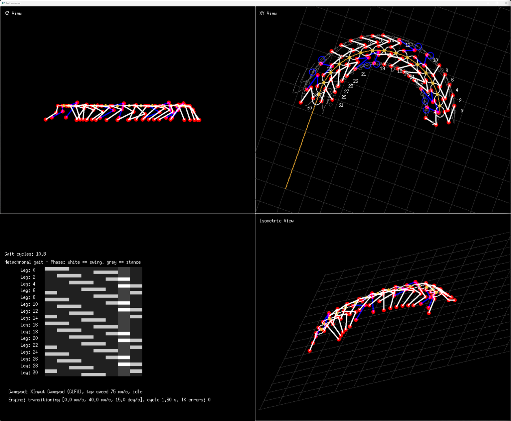

# Segmented bodies (centipedes)

A pod can have a body made of a chain of segments instead of one piece. Example pod 9 (`reset 9`) is a centipede: 16
segments, each with a pair of legs, joined by yaw joints, walking with a metachronal gait.

*`reset 9`, `walk 0 40 0`, then `walk 0 40 15`: the body follows the head into the curve. Segments are drawn as
ellipses, the joints between them as small yellow circles, and swinging legs in blue.*

## How it works

### The body

* **Segments** are joined by **yaw joints** (they bend sideways) halfway between them. Each leg belongs to a segment,
  and its mount position is in that segment's frame ([robot/segments.go](../robot/segments.go)).
* **Follow the leader:** the head walks like a one piece pod. Every other segment follows the path the head has
  walked, 30 mm (the spacing) behind the segment in front of it, like the carriages of a train. A segment's heading is
  the direction of the path through it, and a joint's angle is the difference between the headings of the two
  segments it joins.
* **Turning:** walking a curve bends the joints as the curve reaches them. With 30 mm between the segments and 25
  degree joints, the tightest curve has a radius of about 70 mm. Turning on the spot only bends the first
  joint, and the head stops turning when that joint reaches its limit (25 degrees). Walking forward while turning lets
  the rest of the body follow.
* The joints are meant to be driven by servos (active yaw): the planned body shape is then the real one.

### The legs

The centipede's legs have **two joints**, femur and tibia, and a **fixed coxa**. They are mounted pointing forwards,
so they swing forwards and backwards in a vertical plane beside the segment. A [femur twist](designing-a-pod.md#twisted-joints)
of 35 degrees leans the plane outwards, so the feet stand splayed out from the body.

A two joint leg can't move its foot sideways. When a segment turns in a curve, its feet should move a little sideways
relative to the segment, so they slip: the inverse kinematics puts each foot as close to its target as the leg's
plane allows (at most 15 mm off).

### Walking

* The gait engine keeps each foot in its own segment's frame. A grounded foot is moved by its segment's motion, so it
  stays where it is on the ground, and a swinging foot aims for its neutral position on its segment.
* **Metachronal gait:** a wave of steps runs along the body from the head to the tail, as in centipedes. Each segment
  lifts its legs 1/8 of a cycle after the segment in front of it, and the left and right legs of a segment are half a
  cycle apart. Each leg is on the ground for 3/4 of the cycle.
* The feet lift by 40% of the body's height (14 mm), instead of the 50 mm of the one piece pods.

## Driving it

| Command | Does |
|---|---|
| `reset 9` | Load the centipede |
| `walk 0 <y> <yaw>` | Walk forwards and turn (positive turns are to the right). A segmented body can't walk sideways, so x is ignored. Walking backwards, the body backs up along the path it came |
| `run centipede` | A demo script ([scripts/centipede.goik](../scripts/centipede.goik)): a slalom, a circle to the left and one to the right, faster and slower, turning the head on the spot, and backwards |
| `halt` | Stop and step back into the neutral stance |
| `gait metachronal` | The metachronal gait (the only gait for a segmented body) |
| Gamepad | Left stick forwards and backwards, right stick to turn. Sideways, pitch and roll do nothing |

The views centre on the middle of the body, and the gait view fits all 32 legs.

The metachronal gait also works for one piece pods (`gait metachronal`): each side's legs step in turn from the front
to the back, the two sides half a cycle apart.

## Limits

* No body pose (pitch, roll, shifting the body), no `stance`, no `design` and no CAD export for segmented bodies yet.
* The centipede's sizes (30 mm segments, 32 mm femurs, 48 mm tibias) are for the simulator: the servos haven't been
  chosen yet.

## Next steps

1. **Choose the servos** for the legs (2 x 32) and the joints (15), and size the segments around them.
2. **Servo mapping** for the joints between the segments, so the yaw servos can be driven.
3. **Designing segmented bodies** in the shell: number of segments, spacing, legs per segment, joint range.
4. **Undulation:** a sideways wave along the body on top of following the head, tied to the leg wave, as real
   centipedes do at speed.
5. **Body pose** for segmented bodies (lifting the head, for example), and pitch joints for uneven ground.
6. **CAD:** a printable segment module with the yaw joint and its servo.
