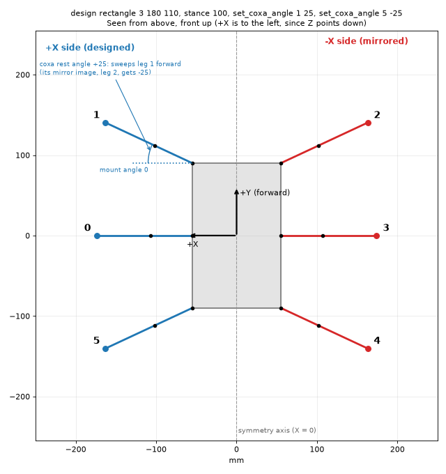
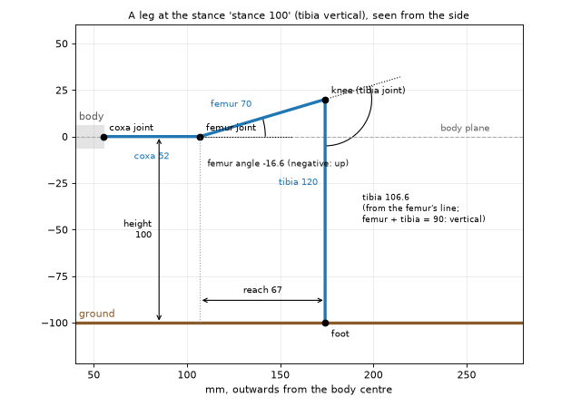
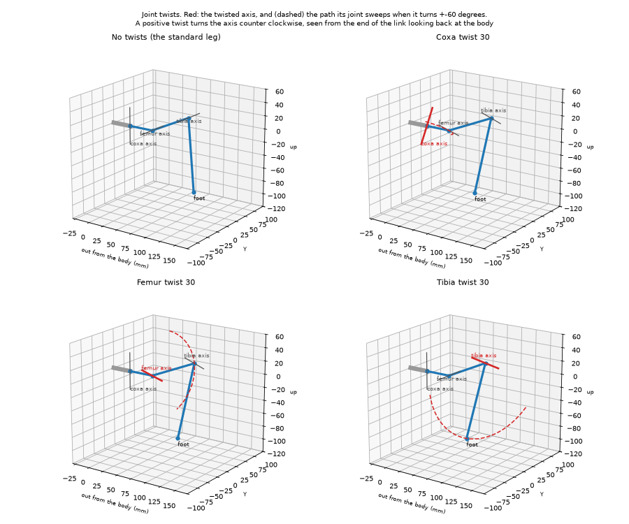
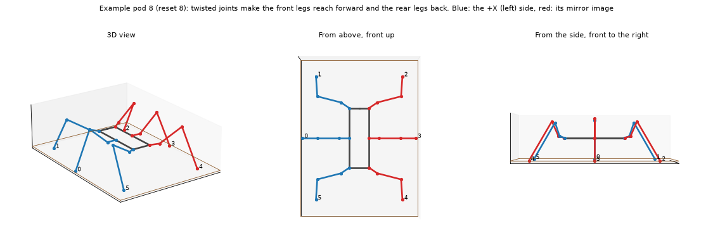
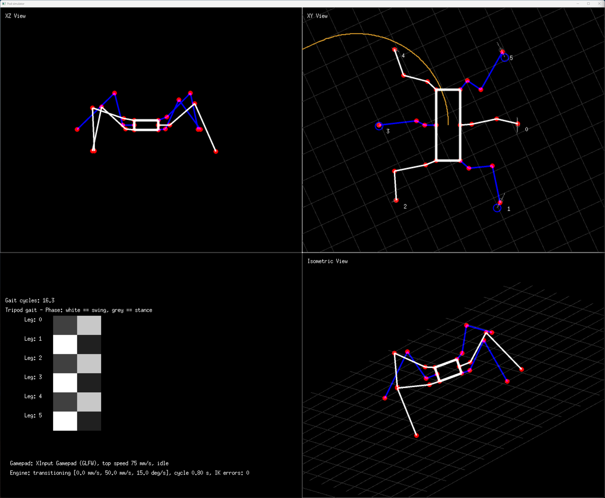

# Designing a pod

This guide shows how to design a pod in the simulator's shell: the body and where the legs are mounted, the length of
each leg segment, the joint angles, and how high the pod stands. Every change shows up in the views right away, and
the pod can walk as soon as it is designed.

Lengths are in mm and angles in degrees. The examples show the shell's output without the echoed command.

* [Quick start: a six legged pod](#quick-start-a-six-legged-pod)
* [How a pod is described](#how-a-pod-is-described): coordinates, legs, joint angles and leg numbers
* [Designing the body](#designing-the-body): templates, adding and moving legs, the outline
* [Segment lengths and joint angles](#segment-lengths-and-joint-angles)
* [Twisted joints](#twisted-joints): joint axes that aren't horizontal or vertical, and the insect example
* [Stance: how high the pod stands](#stance-how-high-the-pod-stands)
* [Pods without a design](#pods-without-a-design)
* [Servos, saving and next steps](#servos-saving-and-next-steps)
* [Command reference](#command-reference)

There are two ways to design a pod:

* **With a design** (recommended): the pod is symmetric about its forward axis. You design one side, and the other
  side is mirrored. Any change to a leg changes its mirror image too.
* **Leg by leg**: every leg is set on its own. This is for pods that aren't symmetric, like example pods 3 to 5.

## Quick start: a six legged pod

A rectangular hexapod with STS3215 servos, front and rear legs swept forward and backward:

```
reset 7                       # example pod 7: STS3215 servos, coxa 52, femur 70, tibia 120 mm
design rectangle 3 180 110    # a 110 x 180 mm body with 3 legs per side, copying leg 0 of the current pod
stance 100                    # the body stands 100 mm above the ground, tibias vertical
set_coxa_angle 1 25           # sweep the front legs (leg 1 and its mirror image, leg 2) forward
set_coxa_angle 5 -25          # sweep the rear legs (leg 5 and its mirror image, leg 4) backward
walk 0 60 0                   # walk forward at 60 mm/s
halt
save my_hexapod               # pods/my_hexapod, with the design and the stance
```

`design rectangle` shows the new design:

```
Pod design: 6 legs, symmetric about the Y axis (+Y is forward). Legs on the -X side mirror those on the +X side (shown)
Outline (+X half): (0.00, 90.00) (55.00, 90.00) (55.00, -90.00) (0.00, -90.00)
Legs 0 (+X) and 3 (-X): (55.00, 0.00), mount angle 0.00, coxa 52.00, femur 70.00, tibia 120.00 mm, rest angles 0.00 / -11.00 / 94.00
Legs 1 (+X) and 2 (-X): (55.00, 90.00), mount angle 0.00, coxa 52.00, femur 70.00, tibia 120.00 mm, rest angles 0.00 / -11.00 / 94.00
Legs 5 (+X) and 4 (-X): (55.00, -90.00), mount angle 0.00, coxa 52.00, femur 70.00, tibia 120.00 mm, rest angles 0.00 / -11.00 / 94.00
```

and `stance 100` computes the femur and tibia angles:

```
Stance: body 100 mm above the ground, tibia vertical
Leg 0: femur -16.6, tibia 106.6 degrees, foot 67 mm out from the femur joint
...
Leg 5: femur -16.6, tibia 106.6 degrees, foot 67 mm out from the femur joint
The feet can step 90 mm around the neutral stance (with the default step height of 50 mm)
Stability margin: the centre of the body is 90 mm inside the feet's support polygon
Possible heights with these reach settings: 85 to 175 mm
```

The result, seen from above:



## How a pod is described

### Coordinates

The body's centre is the origin.

* **+Y is forward.** Walking forward is `walk 0 <speed> 0`.
* **+X is sideways.** Seen from above with the front up, +X is to the left, since Z points down.
* **Z points down, towards the ground.** The coxa and femur joints are at Z = 0, the body plane, so the feet are at
  positive Z.

The simulator's XY view shows the pod from above with +X to the right, so the front (+Y) is at the bottom.

### A leg

Each leg has three joints and three segments:



| Part | What it is |
|---|---|
| Mount position | Where the coxa joint is on the body (x, y) |
| Mount angle | The direction the coxa points at a coxa angle of 0. 0 points to +X (sideways), 90 forward, 180 to -X, 270 backward |
| Coxa length | From the coxa joint (vertical axis) to the femur joint |
| Femur length | From the femur joint to the knee (the tibia joint) |
| Tibia length | From the knee to the foot |

The joint angles:

| Joint | Angle 0 | Positive |
|---|---|---|
| Coxa | The leg points along its mount angle | Turns the leg from +X towards +Y. On the +X side that sweeps the leg forward; on the -X side backward |
| Femur | The femur is horizontal | Down. A negative femur angle lifts the knee |
| Tibia | The tibia continues the femur's line | Bends the tibia down. When femur + tibia = 90, the tibia is vertical |

The **rest angles** are the joint angles in the neutral stance. The gait engine walks around it, and `halt` returns
to it.

### Leg numbers

The legs are numbered counter clockwise around the body (from +X towards +Y), starting at +X, as in the example pods.
The gaits rely on this: tripod gait swings every other leg, and wave gait goes around the body one leg at a time.
Leg numbers are shown in the XY view. In a design, adding, moving or removing legs can renumber them; `design` shows
the current numbers.

Gaits work for any number of legs from 3 up. Wave gait always works. Tripod gait needs an even number of legs, and
ripple gait a multiple of 3. A new design keeps the pod's gait if it still works with the new number of legs;
otherwise it gets tripod gait, or wave gait for an odd number of legs.

## Designing the body

### Symmetry

A design is symmetric about the Y axis (the forward axis). You design the +X side, and every leg there gets a mirror
image on the -X side:

| On the +X side | Mirror image on the -X side |
|---|---|
| Position (x, y) | (-x, y) |
| Mount angle a | 180 - a |
| Coxa angle c | -c |
| Segment lengths, femur and tibia angles | The same |

A leg mounted on the axis (x = 0) is a single leg, without a mirror image. It points forward (mount angle 90) or
backward (270), and its coxa rest angle is 0.

`design` shows one line per leg on the axis or mirrored pair, with the values of the +X leg.

### Start from a template

Both templates give every leg the segment lengths and the femur and tibia rest angles of the current pod's leg 0,
pointing straight out (coxa rest angle 0).

**Round:** `design round <legs> <radius>` puts the legs evenly on a circle, pointing outwards. With an even number of
legs, leg 0 points straight to +X. With an odd number, a leg points forward:

```
design round 8 90
```
```
Pod design: 8 legs, symmetric about the Y axis (+Y is forward). Legs on the -X side mirror those on the +X side (shown)
Outline (+X half): (0.00, 90.00) (63.64, 63.64) (90.00, 0.00) (63.64, -63.64) (0.00, -90.00)
Legs 0 (+X) and 4 (-X): (90.00, 0.00), mount angle 0.00, coxa 52.00, femur 70.00, tibia 120.00 mm, rest angles 0.00 / -11.00 / 100.00
Legs 1 (+X) and 3 (-X): (63.64, 63.64), mount angle 45.00, coxa 52.00, femur 70.00, tibia 120.00 mm, rest angles 0.00 / -11.00 / 100.00
Leg 2 (on the axis): (0.00, 90.00), mount angle 90.00, coxa 52.00, femur 70.00, tibia 120.00 mm, rest angles 0.00 / -11.00 / 100.00
Legs 7 (+X) and 5 (-X): (63.64, -63.64), mount angle 315.00, coxa 52.00, femur 70.00, tibia 120.00 mm, rest angles 0.00 / -11.00 / 100.00
Leg 6 (on the axis): (0.00, -90.00), mount angle 270.00, coxa 52.00, femur 70.00, tibia 120.00 mm, rest angles 0.00 / -11.00 / 100.00
```

`design round 6 80` (with pod 6's legs) is example pod 6.

**Rectangle:** `design rectangle <legs per side> <length> <width>` makes a body `width` mm across (X) and `length` mm
long (Y), with the legs evenly spaced along both sides from the front corner to the rear corner, pointing sideways.
See the [quick start](#quick-start-a-six-legged-pod).

**Import:** `design import` makes a design from the current pod, if it is symmetric about the Y axis. That works for
example pods 0, 1, 2, 6 and 7:

```
reset 6
design import
```

Pods that aren't symmetric are refused, with the leg that has no mirror image:

```
reset 3
design import
```
```
leg 0 has no mirror image (a leg at (-40.00, 0.00) pointing at 180.00 degrees, with the same segment lengths and a coxa rest angle of 0.00). Only pods that are symmetric about the Y axis can be designed
```

### Add, move, turn and remove legs

Positions and angles are given as seen on the leg you name, so either leg of a mirrored pair can be used.

```
design add 0 90 90       # a single leg on the axis at the front (x = 0, y = 90), pointing forward
design add 55 45 0       # a leg on the +X side at (55, 45), pointing sideways, and its mirror image at (-55, 45)
design move 0 55 10      # move leg 0 (and its mirror image) to (55, 10), keeping its mount angle
design move 0 55 10 20   # ... and turn it to a mount angle of 20 degrees
design angle 1 70        # turn leg 1's mount (and its mirror image's, to 110 degrees)
design remove 2          # remove leg 2 (and its mirror image)
design scale 1.2         # make the body 20% larger: every leg moves out from the centre, the legs stay the same
design radius 90         # the same, to a size: the leg mount furthest from the centre ends up 90 mm from it
```

A new leg is a copy of the first leg in the design. Changing the number of legs can change the gait, and resets the
servo mapping to the defaults, since servo ids follow the leg numbers:

```
design add 0 90 90
```
```
The pod now has 7 legs and uses wave gait
The number of legs changed, so the servo mapping is reset to the defaults (STS3215)
Pod design: 7 legs, ...
```

The mount angle sets which way the coxa servo points at 0 degrees. To sweep a leg forward or backward at rest, keep the
mount and set the coxa rest angle instead (see [below](#segment-lengths-and-joint-angles)). The joint can then turn
equally far in both directions.

### Body outline

The outline is the shape of the body. You give the +X half, from a point on the axis, through points with x > 0, to
another point on the axis; it is mirrored like the legs:

```
design outline 0 100 45 100 75 50 75 -50 45 -100 0 -100    # an octagon, 150 mm across and 200 mm long
design outline auto                                         # an outline through the legs' mount points
```

The templates and `design import` make an outline through the mount points. The outline is part of the design and
is saved with it, but the views still draw the body through the coxa joints. The interactive designer and the CAD
export will use it (see [pod-designer.md](pod-designer.md)).

### Rules

A design is checked whenever it changes. A change that breaks a rule is rejected with the reason, and the pod stays
as it was:

* At least 3 legs, and no two legs closer than 1 mm to each other
* No leg on the -X side (design the +X side) or at the centre of the body
* Legs on the axis point forward or backward, with a coxa rest angle of 0
* Positive femur and tibia lengths
* The outline starts and ends on the axis, stays on the +X side in between, and doesn't cross itself

`design off` drops the design. The pod keeps its shape, and its legs can then be changed one at a time.

## Segment lengths and joint angles

The leg commands take a leg number or `ALL`:

```
set_coxa_length ALL 52
set_femur_length ALL 70
set_tibia_length ALL 130
set_coxa_angle 1 25       # rest angles
set_femur_angle 1 -20
set_tibia_angle ALL 100
```

With a design, a leg's mirror image changes with it:

```
set_tibia_length ALL 130
```
```
Changing tibia length of leg 0 to 130.00 (and of leg 3, its mirror image)
Changing tibia length of leg 1 to 130.00 (and of leg 2, its mirror image)
Changing tibia length of leg 5 to 130.00 (and of leg 4, its mirror image)
```

`ALL` changes each pair once, from its +X leg. So `set_coxa_angle ALL 20` sweeps the +X legs 20 degrees forward and
their mirror images 20 degrees forward on their side too (-20). A leg on the axis keeps a coxa rest angle of 0.

The femur and tibia rest angles can be typed in like this, but it is easier to let a [stance](#stance-how-high-the-pod-stands)
compute them. While a pod has a stance, `set_femur_angle` and `set_tibia_angle` are refused:

```
the pod's stance sets the femur and tibia rest angles. Change the stance ('stance <height> [reach]') or remove it ('stance off')
```

Changing a segment length while the pod has a stance recomputes the femur and tibia angles, so the body keeps its
height.

## Twisted joints

Each joint's rotation axis can be turned ("twisted") about the link that leads into the joint. The joint still turns
in a plane, but that plane doesn't have to be horizontal or vertical any more. With all twists 0 (the default) the leg
is the standard leg described [above](#a-leg).

| Twist | The axis is turned about | 0 | What it does |
|---|---|---|---|
| Coxa twist | The mount direction (out from the body) | The coxa axis is vertical | The coxa swings on a tilted cone instead of a flat circle |
| Femur twist | The coxa | The femur axis is horizontal, square to the coxa | The femur and tibia swing in a plane that leans sideways |
| Tibia twist | The femur | The tibia axis is parallel to the femur axis | The foot swings out of the femur's plane |

A positive twist turns the axis counter clockwise, seen from the end of the link looking back towards the body.
Twists are limited to 45 degrees either way, to keep the brackets printable.



```
set_coxa_twist <ALL | leg> <degrees>
set_femur_twist <ALL | leg> <degrees>
set_tibia_twist <ALL | leg> <degrees>
```

With a design, the mirror image gets the opposite twist, so the pod stays symmetric:

```
set_femur_twist 1 -20
```
```
Changing femur twist of leg 1 to -20.00 (and of leg 2, its mirror image)
```

A leg on the symmetry axis can't be twisted, since it is its own mirror image. `design` shows the twists of each leg
(coxa / femur / tibia), and they are saved with the pod.

### Twists move the feet

Twisting a joint moves the foot, usually forwards or backwards along the body. The same twist on every leg moves every
foot the same way, so the centre of the body ends up near one end of the feet's support polygon, and the pod becomes
easy to tip over while it lifts a foot. Balance the twists instead: twist the front legs one way and the rear legs the
other. `stance` shows the stability margin, how far the centre of the body is inside the support polygon:

```
stance
```
```
...
Stability margin: the centre of the body is 142 mm inside the feet's support polygon
```

For the rectangular quick start pod, the same femur twist of 25 degrees on all legs moves the feet 47 mm back and cuts
the margin from 90 to 43 mm. Front legs twisted forward and rear legs back keep it at 85 mm.

### Example: the insect (example pod 8)

`reset 8` loads an insect like hexapod: a long, narrow body carried low, short coxas, and knees high above the body.
The front legs are swept forward and twisted so their feet reach forward; the rear legs mirror that backwards:

```
Legs 0 (+X) and 3 (-X): (25.00, 0.00), mount angle 0.00, coxa 25.00, femur 70.00, tibia 110.00 mm, rest angles 0.00 / -41.54 / 108.75
Legs 1 (+X) and 2 (-X): (25.00, 75.00), mount angle 0.00, coxa 25.00, femur 70.00, tibia 110.00 mm, rest angles 35.00 / -29.67 / 107.10, twists -15.0 / -25.0 / 15.0
Legs 5 (+X) and 4 (-X): (25.00, -75.00), mount angle 0.00, coxa 25.00, femur 70.00, tibia 110.00 mm, rest angles -35.00 / -29.67 / 107.10, twists 15.0 / 25.0 / -15.0
```



Walking an arc (`walk 0 50 15`) with the front of the body raised (`pitch 8`):



The insect is a showcase for twisted joints: its coxas are too short for real servos.

### Stance and walking with twists

A stance works with twisted legs. Their femur and tibia angles have no simple formula, so they are solved numerically,
with the same checks. A tibia generally can't stand vertical on a twisted leg, so the default reach is the one a
vertical tibia would give without the twists.

The gait engine's inverse kinematics (finding the joint angles that put a foot where it should be) also works
numerically for twisted legs. See [kinematics.md](kinematics.md#twisted-joints).

The CAD export builds printable brackets for femur and tibia twists, within limits that depend on the servo (21
degrees for the AX-12A). Coxa twists can't be exported yet. Twisted brackets take more room: if neighbouring legs
collide, make the body larger with `design scale`. See [cad-export.md](cad-export.md#twisted-joints), with an
example exported to Fusion 360.

## Stance: how high the pod stands

A stance says where the feet are, and the femur and tibia rest angles are computed from it:

* **Height:** how high the body plane (the coxa and femur joints) is above the ground.
* **Reach:** how far out each foot stands, measured horizontally from its femur joint. By default the tibia stands
  vertical: that is the classic hexapod stance, and it keeps the static load on the tibia servo small. The reach then
  follows from the height.

```
stance 100             # 100 mm above the ground, tibias vertical
stance 100 110         # feet 110 mm out from the femur joints
stance 120             # change the height only (the reach settings stay)
stance 120 vertical    # back to vertical tibias
stance reach 0 125     # leg 0 (and its mirror image) 125 mm out
stance reach 0 default # leg 0 back to the pod's reach
stance                 # show the stance
stance off             # set the femur and tibia angles by hand again (they stay as they are)
```

`stance` shows the computed angles, how far the feet can step around the neutral stance (this limits the stride when
walking), the stability margin (how far the centre of the body is inside the feet's support polygon), and the range
of heights that work with the reach settings. For the quick start pod with 130 mm tibias:

```
stance reach 0 125
```
```
Stance: body 100 mm above the ground, feet 110 mm out from the femur joints
Leg 0: femur -13.9, tibia 77.9 degrees, foot 125 mm out from the femur joint (set for this leg)
Leg 1: femur -18.7, tibia 89.1 degrees, foot 110 mm out from the femur joint
Leg 2: femur -18.7, tibia 89.1 degrees, foot 110 mm out from the femur joint
Leg 3: femur -13.9, tibia 77.9 degrees, foot 125 mm out from the femur joint (set for this leg)
Leg 4: femur -18.7, tibia 89.1 degrees, foot 110 mm out from the femur joint
Leg 5: femur -18.7, tibia 89.1 degrees, foot 110 mm out from the femur joint
The feet can step 45 mm around the neutral stance (with the default step height of 50 mm)
Stability margin: the centre of the body is 90 mm inside the feet's support polygon
Possible heights with these reach settings: 10 to 135 mm
```

The coxa rest angles are not part of the stance: sweeping a leg with `set_coxa_angle` keeps its height and reach.

### What is checked

A stance, and every change while the pod has one, is refused if:

* The body is less than 10 mm above the ground
* A tibia can't stand vertical at that height (with the default reach): that needs a height between tibia - femur and
  tibia + femur
* A foot would be further from its femur joint than 95% of femur + tibia (the leg would be locked straight), or closer
  than the leg can fold
* A knee would not be above its foot
* A femur or tibia angle is outside the servo's range (AX-12A and XL-320: +-150 degrees, STS3215: +-180) or the
  joint's soft limits in the servo mapping
* The feet can step less than 20 mm around the neutral stance (with the default step height of 50 mm)

The error says what failed, and which heights would work (in 5 mm steps):

```
stance 60
```
```
leg 0: the tibia (130 mm) can't stand vertical at a height of 60 mm with a 70 mm femur (only between 60 and 200 mm, not at the ends). Give a reach (stance <height> <reach>). Possible heights with this reach: 95 to 185 mm
```

Two limits to know about:

* The height is measured to the body plane. The base plate and the servo cases are lower, and nothing checks yet
  that they clear the ground, so a low stance with a wide reach (down to 10 mm) can look possible. See the "Validate a
  design" item in the [roadmap](../ROADMAP.md).
* Changing the servo mapping's limits or servo model doesn't check the stance again. Setting the stance again does.

The stance is saved with the pod. If the number of legs changes, the per leg reach settings are dropped.

## Pods without a design

Pods that aren't symmetric about the Y axis (example pods 3, 4 and 5), and pods after `design off`, are designed leg
by leg. Segmented bodies (the centipede, example pod 9) can't be designed with `design` yet: see
[centipede.md](centipede.md). The leg commands then change only the leg you name, and `ALL` changes every leg the same way. Note that a
positive coxa angle sweeps a leg on the +X side forward, but a leg on the -X side backward.

The mount positions and mount angles of such pods can only be changed in code (robot/examplePods.go). A stance works
the same as with a design:

```
reset 3
stance 130 80
```

## Servos, saving and next steps

* `servo_model <AX-12A | STS3215 | XL-320>` selects the servos. The joint range checks of the stance use it. See
  [servos.md](servos.md) for the servo mapping (ids, offsets, soft limits).
* `save <name>` stores the pod in `pods/<name>`, with its design, stance and servo mapping. `load <name>` loads it.
* Walk it: `walk 0 60 0`, `walk 0 0 20` (turn), `gait wave`, `halt`, or drive it with a gamepad. See
  [simulator.md](simulator.md) and [scripts.md](scripts.md).
* `export_cad <name>` exports it to a STEP assembly with printable brackets, and checks the rest pose for collisions
  between the servos and brackets (femur and tibia twists are supported, coxa twists not yet). See
  [cad-export.md](cad-export.md).

## Command reference

### Design

| Command | Does |
|---|---|
| `design` | Show the design: the outline and one line per leg or mirrored pair |
| `design import` | Make a design from the current pod, if it is symmetric about the Y axis |
| `design round <legs> <radius>` | New design: legs evenly on a circle, pointing outwards |
| `design rectangle <legs per side> <length> <width>` | New design: a rectangular body, legs along its sides, pointing sideways |
| `design add <x> <y> <angle>` | Add a leg on the +X side (mirrored), or on the axis (x = 0) |
| `design move <leg> <x> <y> [angle]` | Move a leg and its mirror image, optionally with a new mount angle |
| `design angle <leg> <angle>` | Change the mount angle of a leg and its mirror image |
| `design remove <leg>` | Remove a leg and its mirror image |
| `design outline <x y x y ...>` | Set the +X half of the body outline |
| `design outline auto` | An outline through the legs' mount points |
| `design scale <factor>` | Make the body larger (factor above 1) or smaller: the leg mounts and the outline move away from or towards the centre. The legs, their twists and the stance stay |
| `design radius <mm>` | Scale the body (like `design scale`) so the leg mount furthest from the centre is `<mm>` from it. `design` shows the current radius |
| `design off` | Drop the design (the pod keeps its shape) |

### Legs

| Command | Does |
|---|---|
| `set_coxa_length <ALL \| leg> <mm>` | Coxa length. Also `set_femur_length` and `set_tibia_length` |
| `set_coxa_angle <ALL \| leg> <degrees>` | Coxa rest angle |
| `set_femur_angle <ALL \| leg> <degrees>` | Femur rest angle (only without a stance). Also `set_tibia_angle` |
| `set_coxa_twist <ALL \| leg> <degrees>` | Twist of the coxa axis (-45 to 45). Also `set_femur_twist` and `set_tibia_twist` |
| `effectors` | Print the foot positions |

### Stance

| Command | Does |
|---|---|
| `stance <height> [reach \| vertical]` | Set the body's height above the ground, and optionally the reach |
| `stance reach <leg> <reach \| default>` | The reach of one leg (and its mirror image) |
| `stance` | Show the stance, the angles per leg, how far the feet can step, the stability margin and the possible heights |
| `stance off` | Remove the stance; set the femur and tibia rest angles by hand |
